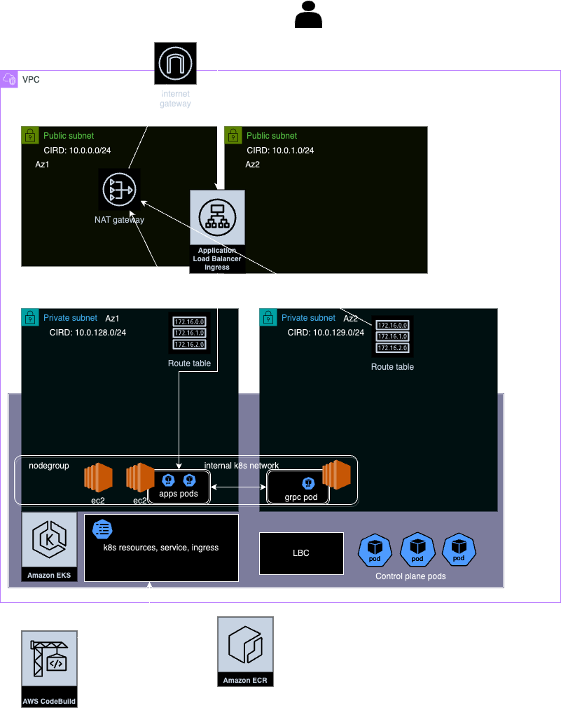

# Table of Contents
1. [Aplicación](#aplicación)
2. [TLDR](#tldr-solo-si-estás-de-afán-hazlo-así-si-tienes-tiempo-ve-a-guía-de-despliegue-paso-a-paso)
3. [Requerimientos](#requerimientos)
4. [Diagrama de arquitectura](#diagrama-de-arquitectura)
5. [Explicación rápida](#explicación-rápida)
6. [Guía de despliegue](#guía-de-despliegue)
  * [¿Por qué estas tfvars?](#¿por-qué-estas-tfvars)
7. [Explicación Networking](#explicación-networking)
8. [Aplicaciones](#aplicaciones)
9. [CI/CD](#cicd)

# Aplicación

Esto es una infraestructura como código usando Terraform para desplegar un cluster de EKS en una nueva VPC y un par de aplicaciones que serán deployments dentro del cluster de Kubernetes.

### TLDR (solo si estás de afán hazlo así, si tienes tiempo ve a: [Guía de despliegue paso a paso](#guía-de-despliegue-paso-a-paso))

Crea un archivo .env en infra/.env con esta forma modificando los respectivos valores:

```bash
aws_profile=juan
aws_account_id=597701726802
OPENAI_API_KEY=TE_LA_ENVIÉ_POR_CORREO
AWS_ACCESS_KEY_ID="aws access key del profile"
AWS_ACCESS_KEY_SECRET="secret key del profile"
TF_STATE_BUCKET="unbucketquenoexista"
AWS_REGION=us-east-1
```

Para inicializar el proyecto:
```bash
cd infra
chmod +x initial.sh
./initial.sh
```

Para desplegar:
```bash
terraform init -backend-config=tf_backend.conf
terraform plan -target=module.network -target=module.eks
terraform apply -target=module.network -target=module.eks -auto-approve
terraform plan
terraform apply -auto-approve
```

Para borrar todo:

```bash
terraform destroy
```

# Requerimientos

* Python ~3
* PIP
* Awscli ~v2
* Docker
* Terraform ~v1.5.5
* Se debe configurar aws cli con un profile de un usuario con suficientes permisos para crear todos los recursos

    ```
    aws configure --profile <PROFILE_NAME>
    ```
    **Este profile es con el cual se desplegará todo**

* El usuario de la maquina que ejecuta terraform debe tener permisos para ejecutar docker (Ya que estoy buildeando las imágenes de las apps durante el proceso)

# Diagrama de arquitectura



# Explicación rápida

Tengo las apps y la infra separadas, no me gusta usar terraform para aprovisionar código (es decir, usar terraform dentro del proceso de CD), pero dado que la prueba requería desplegar las apps con un módulo hice lo siguiente:

* Módulo `networking`: crea todo lo de VPC, subnets, IGW, NAT, etc.
* Módulo `eks`: crea un cluster de EKS con lo mínimo necesario para andar (addons, cni, coredns, nodegroups, etc.).
* Módulo `loadbalancercontroller`: el controlador para permitir la creación de ALBs bajo demanda de ingress.
* Módulo `k8s_apps`: define los manifiestos de Kubernetes para las aplicaciones y todo lo que necesitan.

De esta manera se desligan las aplicaciones de la infraestructura, siendo así que si hay cambios en las apps el único módulo que detectará cambios es `k8s_apps` y no el módulo `eks` (que desde mi punto de vista solo debe desplegar un cluster con lo mínimo necesario).

Se usaron varios providers: aws, helm y kubernetes.

# Guía de despliegue

El proyecto se divide en dos partes: `apps/` e `infra/`. En `apps/` se guardarán las aplicaciones `nea-translator` y `nea-translator-grpc-server`. Para entender más sobre ellas, ir a la sección de: [Aplicaciones](#aplicaciones). En `infra/` está todo el código para realizar el despliegue (Terraform y un poco de bash).

Verifica que tienes los [Requerimientos](#requerimientos).

Debes crear un bucket donde se guardarán los `tfstate`.

```
aws s3 mb s3://<BUCKET_STATES_NAME> --profile <AWS_PROFILE>
```

Otorgar permisos de ejecución al script que se trae el `THUMBPRINT` del cluster para que todo sea automatizado.

```
chmod +x infra/eks/thumbprint.sh
```

Se debe llenar el `tf_backend.conf` con los valores requeridos.

```conf
bucket="<BUCKET_STATES_NAME>"
key="tt/dev"
region="<AWS_REGION>"
profile="<AWS_PROFILE>"
```

Crea el `terraform.tfvars`, te puedes inspirar en `terraform.tfvars.example`.

```conf
aws_profile="<AWS_PROFILE>"
aws_account_id = "<AWS_ACCOUNT_ID>"
OPENAI_API_KEY="Una key temporal del api de OpenAI que seguramente te la enviaré al correo"
AWS_ACCESS_KEY_ID="aws access key del profile"
AWS_ACCESS_KEY_SECRET="secret key del profile"
aws_region = "<AWS_REGION>"
```

#### ¿Por qué estas tfvars?

* Mi app GRPC hace un llamado al API de OpenAI, `OPENAI_API_KEY` la enviaré por correo y la desactivaré después de unos días. Si tienes una key de OpenAI que funcione también la puedes usar.
* `AWS_ACCESS_KEY_ID` y `AWS_ACCESS_KEY_SECRET` las uso para aprovisionar los secretos del agente de CodeBuild. Sé que lo puedo hacer con un rol pero debido a que uso un `AWS_PROFILE` en toda la infra como código y no tengo mucho tiempo, de momento lo dejo así (`deuda técnica`).

Después se debe inicializar el backend S3 (no use lock con DynamoDB ya que al trabajar solo no lo vi necesario).

```
terraform init -backend-config=tf_backend.conf
```

Aplicar los dos primeros módulos (`networking` y `eks`). No se aplican los demás porque el provider de Kubernetes depende de datos que son salida de module.eks (pues depende de que el cluster exista) y terraform plan intenta inicializar todos los providers al hacer el plan.

El siguiente comando entonces desplegará todos los recursos de red (VPC, Subnets, IGW, NAT, etc.) y un cluster de EKS con los addons necesarios:

```
terraform apply -target=module.network -target=module.eks
```

Se aplican el resto de recursos, estos incluyen el AWS Load Balancer Controller, las dos aplicaciones y proyecto de CodeBuild para el CI/CD.

En el primer despliegue en local se buildearán las imágenes de Docker con un local provisioner y se subirán a sus

 respectivos repositorios de ECR.

```
terraform apply
```

`k8s_apps`: contiene los manifiestos de Kubernetes usando el provider de Kubernetes. Con un count (if) controlo si se crea ingress o no, de esta manera reuso el mismo módulo para crear las dos apps.

`codebuild`: es un módulo para crear el proyecto de CodeBuild sencillo. El trigger queda siendo manual desde la UI o a través de AWS CLI. No quise complicar la infra con webhooks de GitHub.

**Puede que los primeros 2 minutos después del despliegue la ruta no funcione pues el balanceador de carga tarda unos minutos en terminarse de aprovisionar.**

**Después de finalizar el despliegue obtendrás un output que es el hostname del ALB:**

```
Outputs:

alb_endpoint = tolist([
  {
    "hostname" = "k8s-default-neatrans-a7b869f0b9-647273833.us-east-1.elb.amazonaws.com"
    "ip" = tostring(null)
    "ports" = tolist(null) /* of object */
  },
])
```

**El cual podrás consumir con un post así:**

Ejemplo:
```bash
curl --location 'k8s-default-neatrans-a7b869f0b9-647273833.us-east-1.elb.amazonaws.com/traducir/' \
--header 'Content-Type: application/json' \
--data '{
    "mensaje": "Esta conmemoración nos evoca ese patriotismo que motiva a izar la bandera, a ponernos prendas de vestir con los colores patrios y a sentirnos orgullosos de nuestros exponentes culturales y sociales",
    "nivel_de_nea": 10,
    "region": "bogota"
}'
```

Resultado:
```json
{
    "traduccion_nea": "Esta jartera nos recuerda ese amor por el parche que nos motiva a fuequear la bandera, a ponernos las trapas con los colores de la chimba y a sentirnos bacanos de nuestros broders culturales y sociales",
    "mensaje": "Esta conmemoración nos evoca ese patriotismo que motiva a izar la bandera, a ponernos prendas de vestir con los colores patrios y a sentirnos orgullosos de nuestros exponentes culturales y sociales",
    "nivel_de_nea": 10,
    "region": "bogota"
}
```

# Explicación Networking

Es una VPC con CIDR en 10.0.0.0/16, con 4 subnets, 2 públicas y 2 privadas para tener HA. Las subnets se dividen usando:

```
cidr_block = cidrsubnet(var.cidr_block, 8, count.index + 128)
```
y
```
cidr_block = cidrsubnet(var.cidr_block, 8, count.index)
```

Se van a usar 8 bits para cada subred 32-8=24, máscara 24 en las subredes, el tercer argumento determina el índice de la subred, empezando desde 0 para las públicas y 128 para las privadas.

Teniendo así las siguientes subnets:

```
10.0.0.0/24 // pública1
10.0.1.0/24 // pública2
10.0.128.0/24 // privada1
10.0.128.0/24 // privada2
```

Se creó un Internet Gateway para dar salida a internet a la VPC. Se asocian las route table de las subnets públicas para que 0.0.0.0/0 salga por el IGW.

Se crea un NatGateway en una de las subnets públicas y se crean route tables con salida 0.0.0.0/0 apuntando al NatGateway. Finalmente, se asocian estas route tables a las subnets privadas, dándole así acceso a internet también a las subnets privadas.

El balanceador de carga es creado automáticamente por el LBC de Kubernetes en una de las subnets públicas y redirige el tráfico a k8s_app client.

k8s_app client se comunica con grpc server por la red interna de Kubernetes apuntando al nombre del servicio.

# Aplicaciones

Es un traductor del español regular al español nea o ñero que llaman, el lenguaje callejero que es diferente en cada región de Colombia.

Está compuesto de un API client en FastAPI (`nea-translator`) y un GRPC Server que recibe los llamados de nea-translator por GRPC y envía peticiones al API de OPENAI para hacer la traducción (`nea-translator-grpc-server`).

Ambas apps están hechas con Python, pipenv para los ambientes virtuales y dependencias. En cada carpeta hay un par de Dockerfiles que sirven como imagen de build y también de runtime. También hay un `docker-compose.yml`, un `start.sh` y un `startbuild.sh` que permiten arrancar en local la aplicación usando `docker-compose` y los secretos que existan en el `.env`.

`nea-translator` tiene una prueba unitaria para simular el CI del proceso de CI/CD.

Para arrancar la aplicación se debe:

* Crear un `.env` colocando el valor de OPENAI_API_KEY.
* Ejecutar `./startbuild.sh`.

# CI/CD

Se creo un proyecto de codebuild que usando las mismas credenciales de aws y el mismo profile re despliega la aplicacion usando este `buildspec.yml`

```yaml
version: 0.2

phases:
  install:
    runtime-versions:
      python: 3.11
    commands:
      - curl -O https://releases.hashicorp.com/terraform/1.5.5/terraform_1.5.5_linux_amd64.zip
      - unzip terraform_1.5.5_linux_amd64.zip
      - chmod +x terraform
      - mv terraform /usr/local/bin/
      - python --version
      - aws --version
      - docker --version
      - pip --version
  pre_build:
    commands:
      - aws configure set aws_access_key_id "$AWS_ACCESS_KEY_ID" --profile "$AWS_PROFILE"
      - aws configure set aws_secret_access_key "$AWS_ACCESS_KEY_SECRET" --profile "$AWS_PROFILE"
      - aws configure set region "$AWS_REGION" --profile "$AWS_PROFILE"
      - aws sts get-caller-identity --profile "$AWS_PROFILE"
      - cd infra
      - echo "aws_profile=\"${AWS_PROFILE}\"" >> terraform.tfvars
      - echo "aws_account_id=\"${AWS_ACCOUNT_ID}\"" >> terraform.tfvars
      - echo "OPENAI_API_KEY=\"${OPENAI_API_KEY}\"" >> terraform.tfvars
      - echo "AWS_ACCESS_KEY_ID=\"${AWS_ACCESS_KEY_ID}\"" >> terraform.tfvars
      - echo "AWS_ACCESS_KEY_SECRET=\"${AWS_ACCESS_KEY_SECRET}\"" >> terraform.tfvars
      - echo "image_version=\"${CODEBUILD_BUILD_NUMBER}\"" >> terraform.tfvars
      - echo "force_image_rebuild=true" >> terraform.tfvars
      - terraform init -backend-config=tf_backend.conf
  build:
    commands:
      - cd ../apps/nea-translator/
      - docker build . -f dockerfile.local  -t nea-translator-test
      - docker container run nea-translator-test pipenv run test
      - cd ../../infra
      - terraform validate
      - terraform apply -auto-approve

```

Quedo sin trigger automatico.